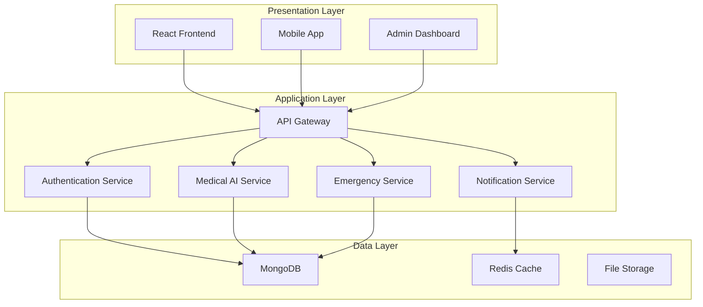
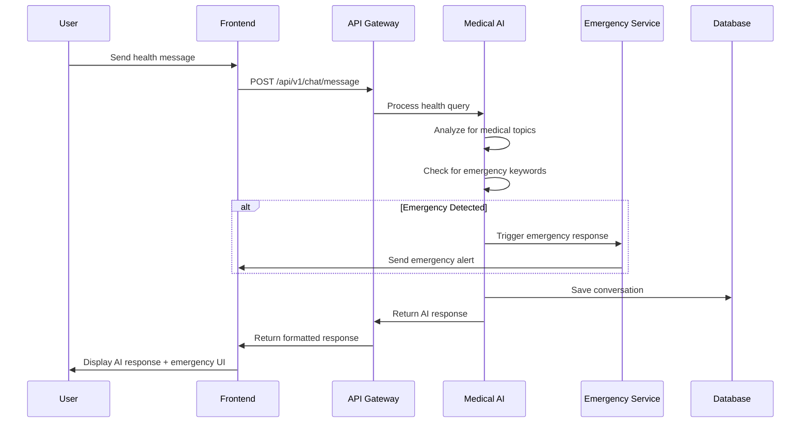
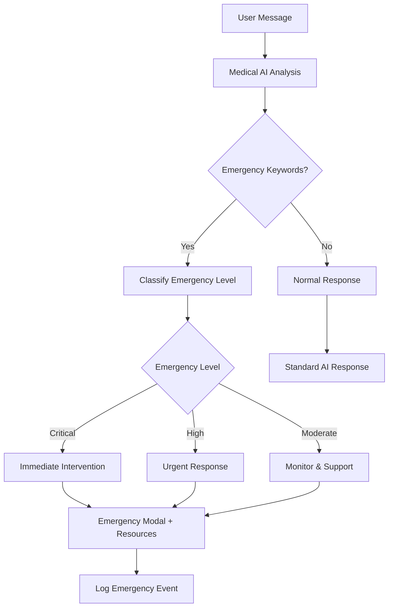
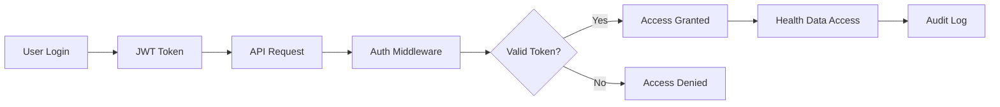
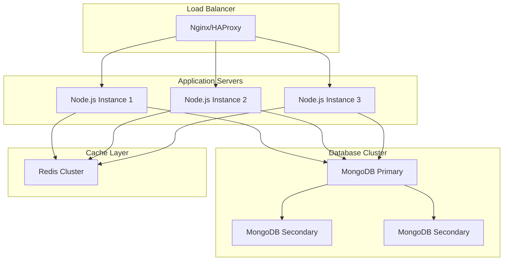
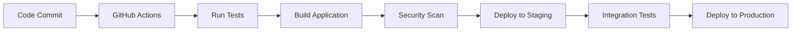

# System Architecture Overview

## 🏗️ High-Level Architecture

Mobile Spo follows a modern three-tier architecture with clear separation of concerns:



## 🔧 Component Architecture

### Frontend Architecture (React)

```
src/
├── components/           # Reusable UI Components
│   ├── ui/              # Base UI Components (shadcn/ui)
│   ├── forms/           # Form Components
│   ├── modals/          # Modal Components
│   └── screens/         # Screen Components
├── services/            # External Service Integration
│   ├── api.ts           # API Client
│   ├── auth.ts          # Authentication Service
│   └── storage.ts       # Local Storage Service
├── hooks/               # Custom React Hooks
│   ├── useChat.ts       # Chat State Management
│   ├── useAuth.ts       # Authentication Hook
│   └── useEmergency.ts  # Emergency Detection Hook
├── types/               # TypeScript Type Definitions
│   ├── api.ts           # API Response Types
│   ├── chat.ts          # Chat Message Types
│   └── user.ts          # User Data Types
├── utils/               # Utility Functions
│   ├── validation.ts    # Input Validation
│   ├── formatting.ts    # Data Formatting
│   └── constants.ts     # Application Constants
└── contexts/            # React Context Providers
    ├── AuthContext.tsx  # Authentication Context
    └── ThemeContext.tsx # Theme Management
```

### Backend Architecture (Node.js)

```
src/
├── routes/              # API Route Handlers
│   ├── auth.js          # Authentication Routes
│   ├── chat.js          # Medical AI Chat Routes
│   ├── health.js        # Health Data Routes
│   ├── emergency.js     # Emergency Response Routes
│   └── users.js         # User Management Routes
├── services/            # Business Logic Services
│   ├── medicalAI.js     # Medical AI Processing
│   ├── emergencyService.js # Emergency Detection
│   ├── conversationService.js # Chat Management
│   └── notificationService.js # Notifications
├── models/              # Database Models
│   ├── User.js          # User Data Model
│   ├── Conversation.js  # Chat Conversation Model
│   ├── HealthRecord.js  # Health Data Model
│   └── Emergency.js     # Emergency Event Model
├── middleware/          # Express Middleware
│   ├── auth.js          # Authentication Middleware
│   ├── validation.js    # Input Validation
│   ├── encryption.js    # Data Encryption
│   └── errorHandler.js  # Error Handling
├── utils/               # Utility Functions
│   ├── logger.js        # Logging Service
│   ├── encryption.js    # Encryption Utilities
│   └── validators.js    # Data Validators
└── database/            # Database Configuration
    ├── connection.js    # MongoDB Connection
    ├── migrations/      # Database Migrations
    └── seeds/           # Test Data Seeds
```

## 🔄 Data Flow Architecture

### Medical AI Chat Flow



### Emergency Detection Flow



## 🔒 Security Architecture

### Authentication & Authorization



### Data Encryption Layers

1. **Transport Layer**: HTTPS/TLS encryption
2. **Application Layer**: JWT token encryption
3. **Database Layer**: Field-level encryption for sensitive data
4. **Storage Layer**: Encrypted file storage

## 📊 Scalability Architecture

### Horizontal Scaling Strategy



## 🔧 Technology Stack

### Frontend Technologies
- **Framework**: React 18 with TypeScript
- **UI Library**: shadcn/ui + Tailwind CSS
- **State Management**: React Hooks + Context API
- **HTTP Client**: Fetch API with custom wrapper
- **Build Tool**: Vite
- **Testing**: Jest + React Testing Library

### Backend Technologies
- **Runtime**: Node.js 18+
- **Framework**: Express.js
- **Database**: MongoDB with Mongoose ODM
- **Authentication**: JWT + bcrypt
- **Validation**: express-validator
- **Logging**: Winston
- **Testing**: Jest + Supertest

### Infrastructure Technologies
- **Containerization**: Docker + Docker Compose
- **Reverse Proxy**: Nginx
- **Process Management**: PM2
- **Monitoring**: Prometheus + Grafana
- **Logging**: ELK Stack (Elasticsearch, Logstash, Kibana)

## 🔄 Development Workflow

### CI/CD Pipeline



### Environment Strategy
- **Development**: Local development with hot reload
- **Staging**: Production-like environment for testing
- **Production**: High-availability production deployment

## 📈 Performance Considerations

### Optimization Strategies
1. **Frontend**: Code splitting, lazy loading, image optimization
2. **Backend**: Connection pooling, query optimization, caching
3. **Database**: Indexing, aggregation pipelines, read replicas
4. **Network**: CDN, compression, HTTP/2

### Monitoring & Alerting
- **Application Metrics**: Response times, error rates, throughput
- **Infrastructure Metrics**: CPU, memory, disk, network usage
- **Business Metrics**: User engagement, emergency response times
- **Security Metrics**: Failed login attempts, suspicious activities
